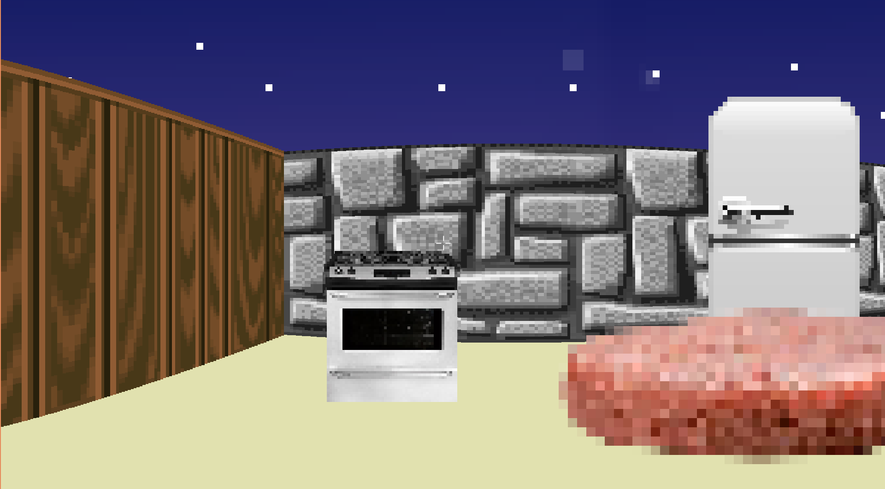
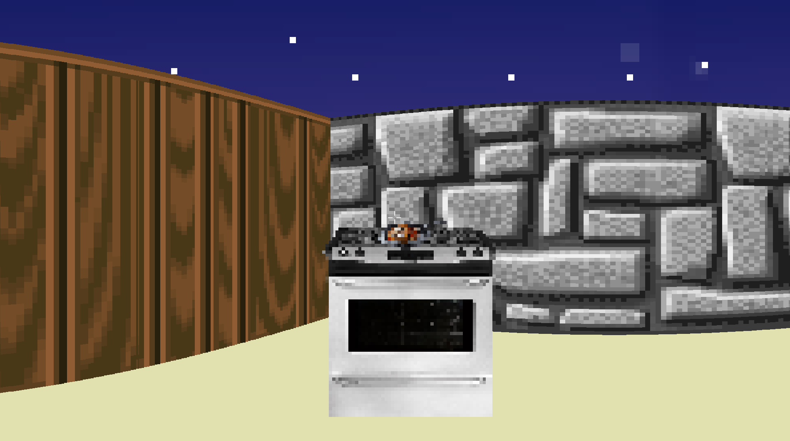
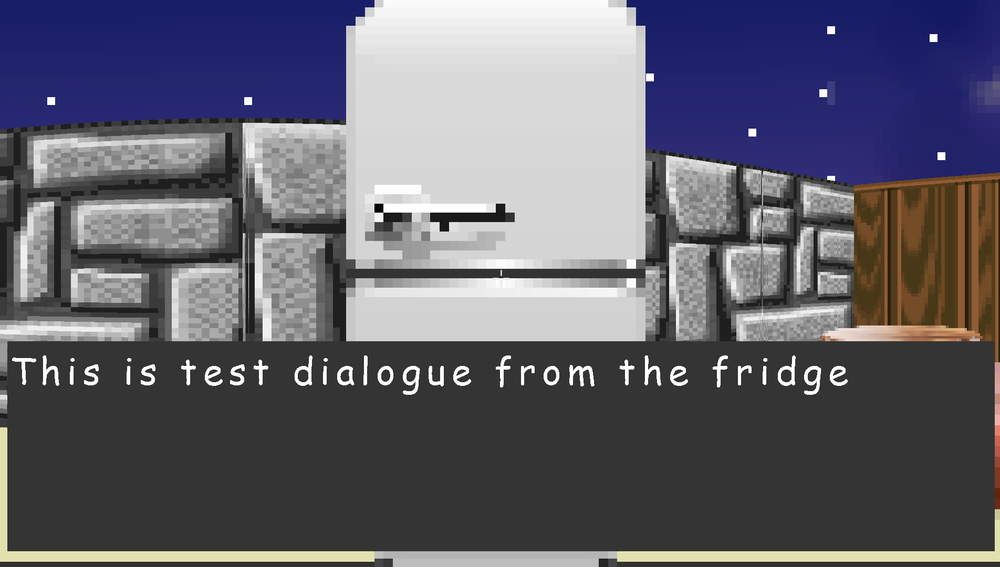

# Raycaster Cooking Game

A real-time 3D raycasting engine and game, built from scratch in C++ with SDL3. The player navigates a raycast-rendered restaurant kitchen, interacting with objects (fridge, stove, table) to cook and assemble food orders, while NPCs move through the level with their own behavior.

*This project is a work in progress — core rendering, interaction, and NPC systems are functional; gameplay/content is still being built out.*






## Features

- Real-time raycasting renderer (DDA algorithm) achieving 60+ FPS
- Sprite rendering with depth-correct occlusion against walls
- Object interaction system (fridge, stove, table) with per-object logic
- NPC behavior driven by a finite-state machine
- Dynamic text rendering (SDL3_ttf) for in-game UI and dialogue
- JSON-driven asset pipeline (`assets/assets.json`) for loading images, sounds, and fonts

## Requirements

- C++17-compatible compiler (Clang or GCC)
- CMake 3.13+ (or `make`, using the included Makefile)
- FreeType and HarfBuzz development libraries (required by `SDL3_ttf`)
  - Debian/Ubuntu: `sudo apt install libfreetype-dev libharfbuzz-dev`
  - Arch: `sudo pacman -S freetype2 harfbuzz`
- SDL3, SDL3_image, SDL3_ttf, SDL3_mixer (prebuilt libraries included under `libs/`)

## Building

### With CMake

```bash
mkdir build && cd build
cmake ..
cmake --build .
```

The executable and assets are placed in `build/bin/`.

### With Make

```bash
make
```

Object files are placed in `objs/`, and the executable is built at the project root.

## Running

```bash
./bin/game    # if built with CMake
./game        # if built with Make
```

## Controls

| Key | Action |
|---|---|
| `W` `A` `S` `D` | Move |
| Mouse | Look around |
| `E` | Interact with object in view |
| `Enter` | Advance dialogue / interaction |
| `Esc` | Quit |

## Project Structure

```
src/          Game source (rendering, player, camera, NPCs, interactable objects)
assets/       Images, sounds, fonts, and assets.json manifest
libs/         Prebuilt SDL3 libraries
```

## Status / Roadmap

- [x] Raycasting renderer
- [x] Sprite rendering and depth sorting
- [x] NPC state machine
- [x] Object interaction system
- [ ] Full gameplay loop / order system
- [ ] Additional levels/content
